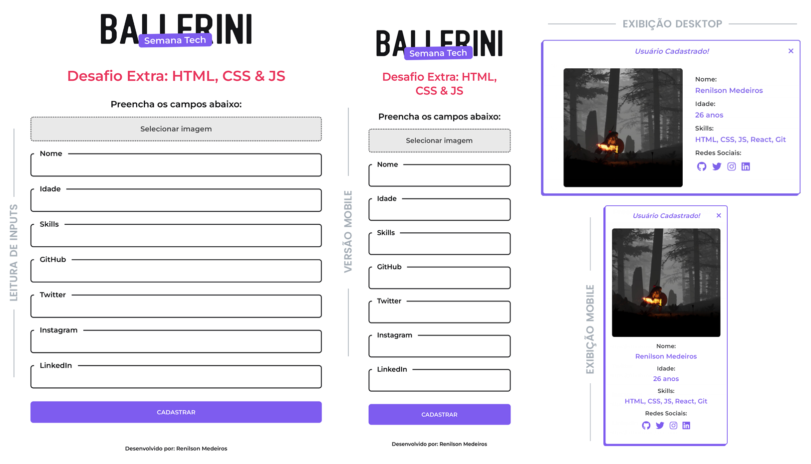

# Desafio Tech - Comunidade da Ballerini

### Desafio era fazer a Leitura de Inputs e Exibir as informações fornecidas.

[Preview](https://malcoon.github.io/tech-da-semana-js/)

### - Screenshot

## Tecnologias usadas:
* HTML5
* CSS3
* JavaScript
* Flexbox

[Comunidade da Ballerini](https://discord.com/invite/wagxzStdcR)